# LABORATORIUM 1
## Autorzy 
Michał Sadowski 325221
Mateusz Ostaszewski 325203

## 1. Złożeznie stanowiska laboratyjnego: zestaw z Raspberry Pi 4B (RPi)

Udało się złożyć stanowisko i zosatło to zatwierdzone przez prwoadzącego

## 2. Pierwsze uruchomienie RPi, sprawdzenie połączenia sieciowego, wykonanie próbnych transferów plików

### Pierwsze uruchoniemie RPi

Po włączeniu zalislania wyświetliły się logi

Zalogowaliśmy się jako root

Został przynany adres ip

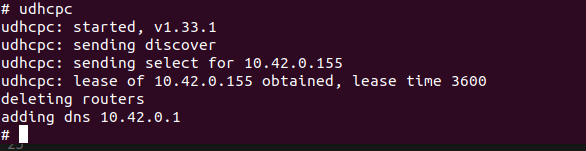

### Sprawdzenie połączenia sieciowego

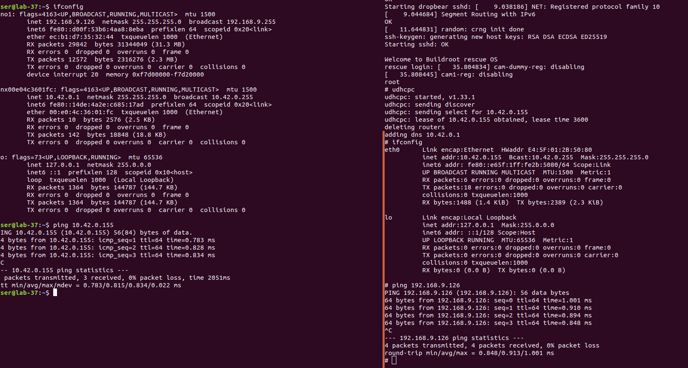
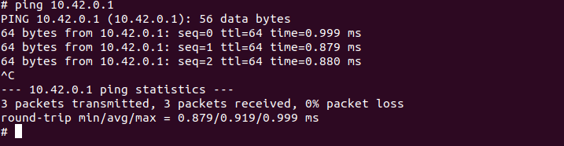

Pingowanie w obie strony działa więc połączenie sieciowe się udało

### Wykonanie próbnych transferów plików

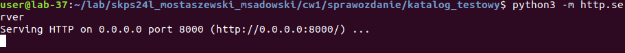

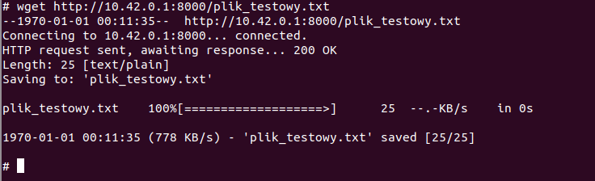

Udało sie przesłać plik testowy z hosta na Rpi 

## 3. Zbudowanie za pomocą buildroot obrazu linuxa dla Rpi z init RAM fs

### Zgodnie z wykładu 1 i 2 zbudowaliśmy system linux w BR. 

    - #make raspberrypi4_64_defdonfig
    - #make menuconfig
        - Toolchain -> Toolchain type: External toolchain
        - Uaktywniona opcja cpio the root filesystem
        - Uaktywniona opcja inital RAM filesystem
        - Dezaktywowana opcja ext/2/3/4
    - #make

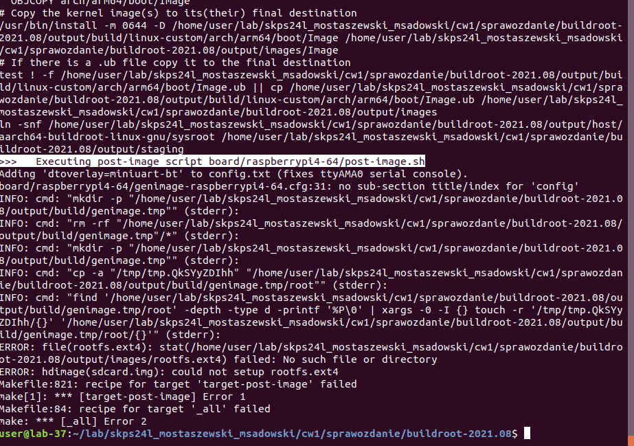    

Make zakończył się błędem lecz był on spodziewany ponieważ wyłączyliśmy ext4 

### Kopiowanie plików image, cmdline.txt i bcm2711-rpi-4-b.dtb

Kopiujemy wyżej wymienione pliki z hosta na RPi korzystając z komunkacji przez serwer http.server

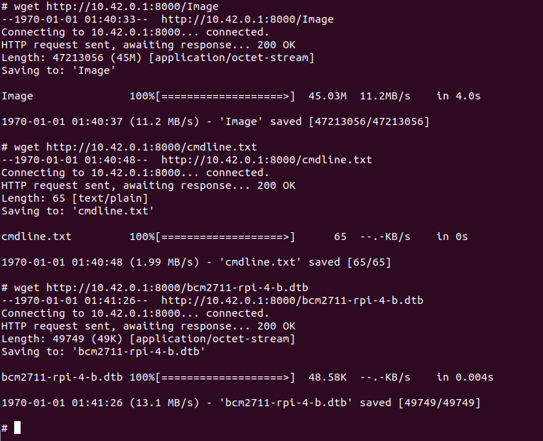

### Montujemy partycje 1 (boot) karty SD 

Przy pomocy polecenia mount montujhemy partycje w katalogu /mnt

Kopiujemy pliki image, cmdline.txt i bcm2711-rpi-4-b.dtb do /mnt/user

Zmieniamy nazwę pliku image na kernel8.img

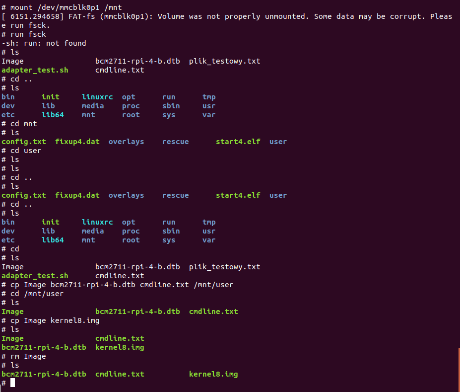

### Resrart RPi

Wykonumemy restart RPi przy pomocy reboot

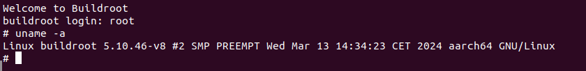

## 4. Zbudowanie za pomocą buildroot obrazu linuxa dla Rpi z systemem plików na trwałym nośniku 

### Usunięcie poprzedniego obrazu

Wykonujemy to za pomocą polecienia:
 #make linux-dirclean
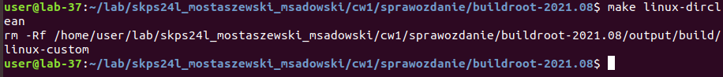
### Wprowadzenie zmian w menu config
    - Toolchain -> Toolchain type: External toolchain
    - Uaktywniona opcja cpio the root filesystem
    - Dezaktywowana opcja inital RAM filesystem
    - Aktywowana opcja ext/2/3/4
    - Zmiana rozmiaru partycji boot na dwa razy większą
    Rekompilacja poleceniem make

    

### Wynikowy obraz jest mniejszy niż w poprzednim ćwiczeniu

Jest to spowodowane tym, że w poprzednim ćwiczeniu filesystem musiał być zawarty w obrazie, a w tym jest osobno pod systemem plików

### Kopiowanie plików na RPi partycję 2

Kopiujemy plik: rootfs.ext2 z host na Rpi korzystając z http.server

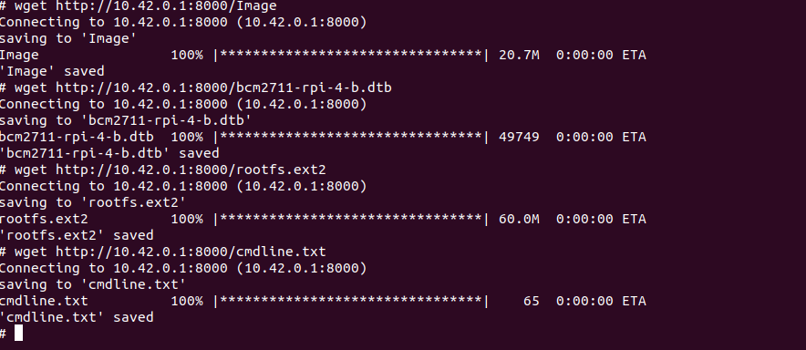 
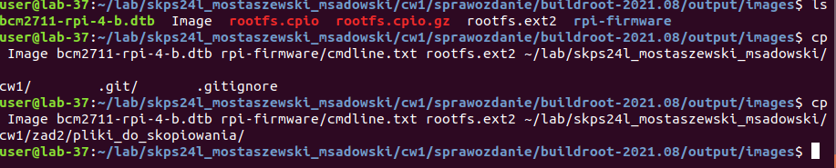
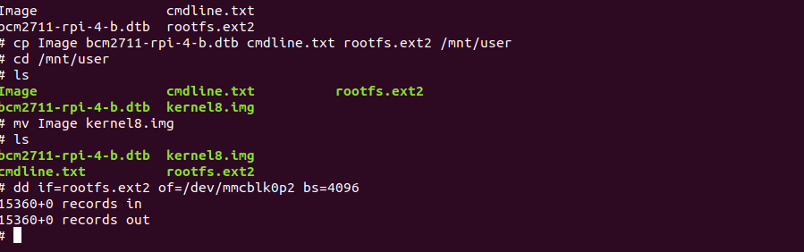

### Test czy system rzeczywiście korzysta z systemu plików

Tworzymy plik test.txt 

Następnie restartujemy buildroot.
