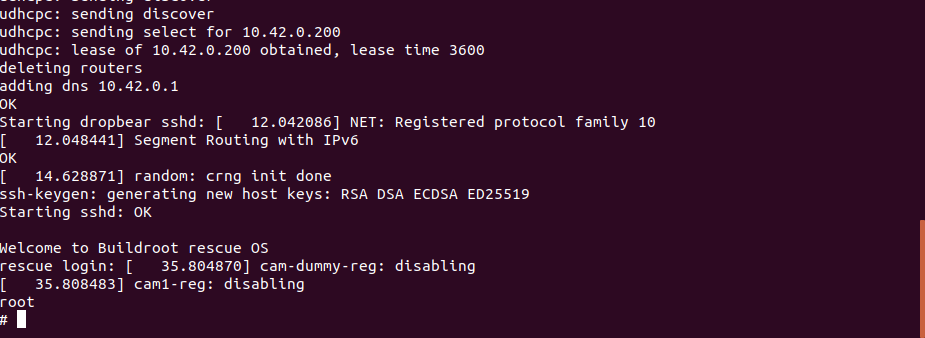

# LABORATORIUM 2
## Autorzy 
Michał Sadowski 325221
Mateusz Ostaszewski 325203

## Instalacja OpenWRT

### Uruchomienie i instalacja operwrt

Uruchomiliśmy system system 

Pobraliśmy system 

Rozpakowaliśmy system

Montujemy 1 partycje oraz 2 partyce (tutaj się pojawiła literówka która poźniej naprawiliśmy)

Kopiujemy pliki

Napotkaliśmy błąd, literówka podczas montowania pliku

Jeszcze raz zamontowaliśmy oraz zwiększyliśmy rozmiar

Po tym zrebootowalismy system

### Konfiguracja sieciowa 

W pliku /etc/config/network zmodyfikowliśmy konfiguracje 

Następnie przy używając polecenia /etc/init.d/network reload zersetowalismy siec

### Interfejs HTTP

Przy pomocy interfejsu http zainstalowalismy pakiety: 
- gpio-tools
- spi-tools
- i2c-tools 
- python3 
- pyhton3-pip
- python3-smbus 
- python3-gpiod
## Zadania

### zadanie 1

Zawartość kodu w pliku zad1.py

### zadanie 2

Zawartość kodu w pliku zad2.py

### zadanie 3

Zawartość kodu w pliku zad3.py

### zadanie 4

Zawartość kodu w pliku zad4.py

Schemat podłączenia buzzera

