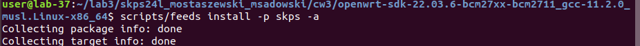
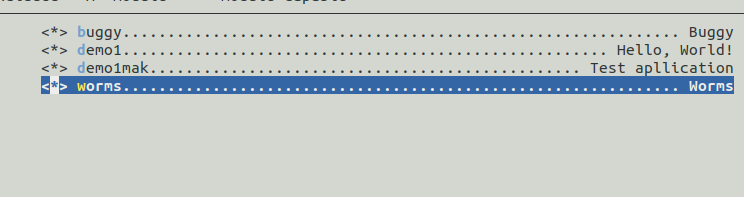
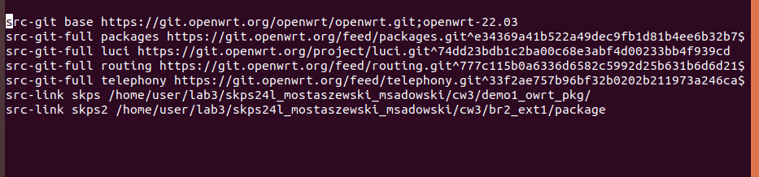
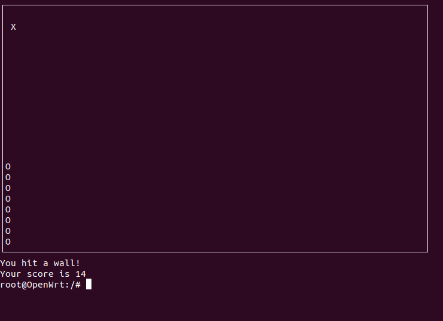

# Sprawozdanie SKPS lab3
## Michał Sadowski Mateusz Ostaszewski 

## zadanie 1

Pobieramy SDK opernwrt. Oraz pakiet demo

W pliku feeds.conf.default dopisalismy ścieżkę:

Update feeds i install

Dodalismy pakiety w make menuconfig

Skompilowalismy pakiet

Poprzez serwer przesłalimsy pakiet na RPi

Odebraliśmy pakiety na RPi

Zainstalowalismy pakiet

Wywołanie programu

## Zadanie 2

Analogicznie jak w 1 zadaniu dodalsmy pakiety

Dodalismy ściezkę

Przesłaliśmy pakiety na RPi

Instalacja pakietów

Uruchomienie programów

WORMS

BUGGY

## Zadanie 3

Zainstalowalismy gbd i gdbserver

### W 1 podpunkcie znaleźlismy niezalokowaną tablice

### W 2 podpunkcie znaleźliśmy błąd wychodzenia poza tablice która jest zalokowana na 1000 intów

