# Sprawozdanie SKPS lab4
## Michał Sadowski Mateusz Ostaszewski 

## Zadanie 1
Przetestowaliśmy program na hoście i działa
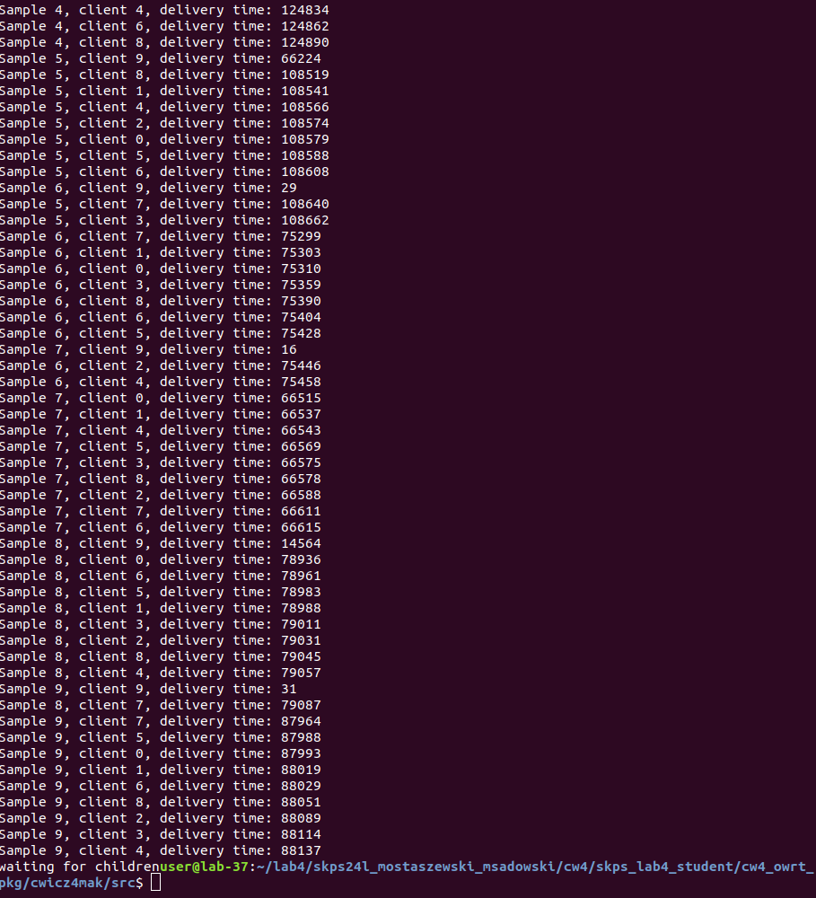

## Zadanie 2
Zainstalowaliśmy SDK
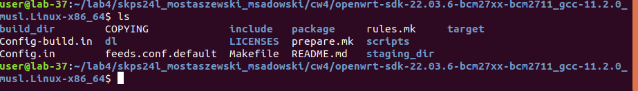

W pliku feeds.conf.default dopisalismy ścieżkę:
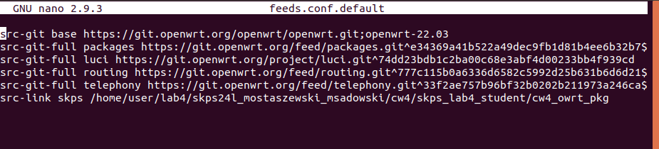

Dodaliśmy oraz skompilowaliśmy pakiet
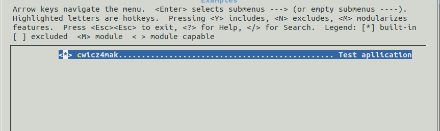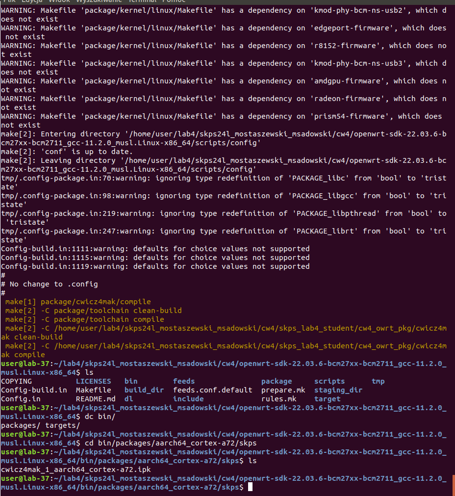

Pobraliśmy skompilowany pakiet na Rpi
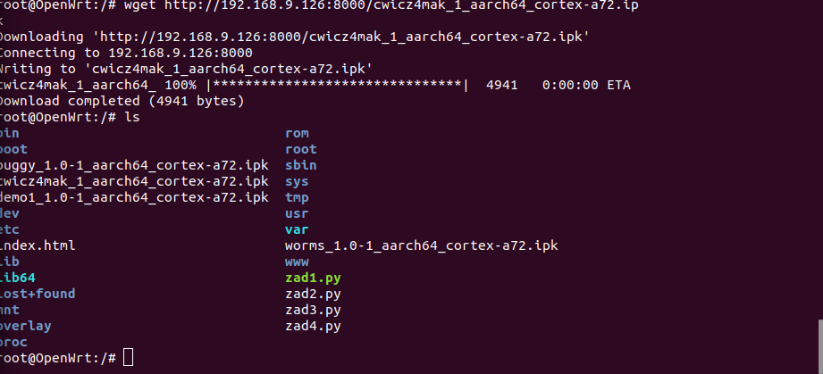

zainstalowalismy pakiet na Rpi
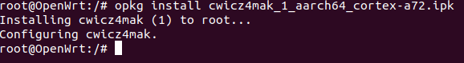

sprawdziliśmy i działa:
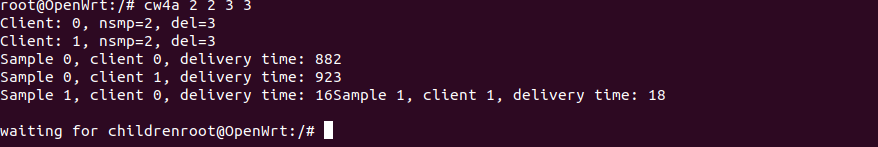

## Zadajnie 3

### Wariant 1 3 klientów, 1 rdzeń, pełne obciążenie
Ustawilismy liczbę rdzeni procesora na 1
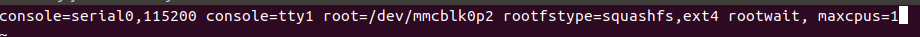

Przy 100.000 wyrabia się
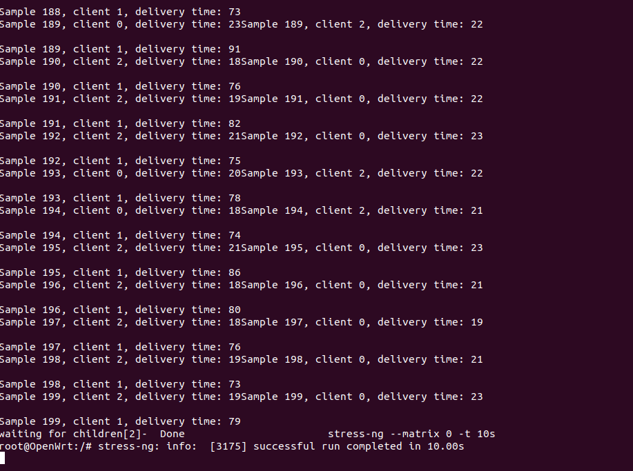

przy 200.000 nadal się wyrabia
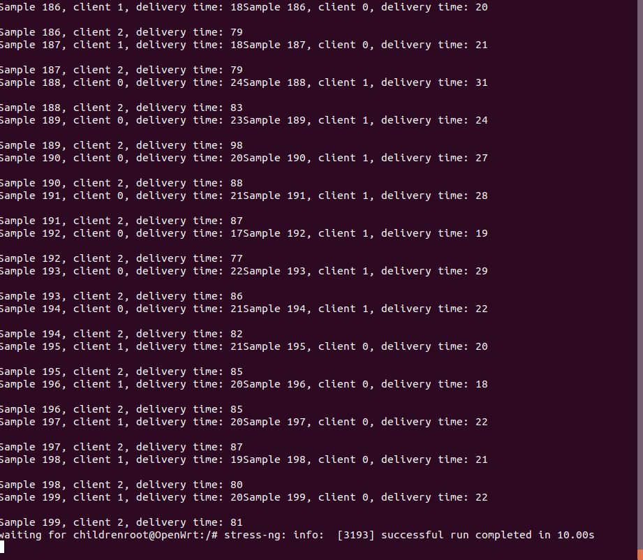

przy 250.00 sie nie wyrabia
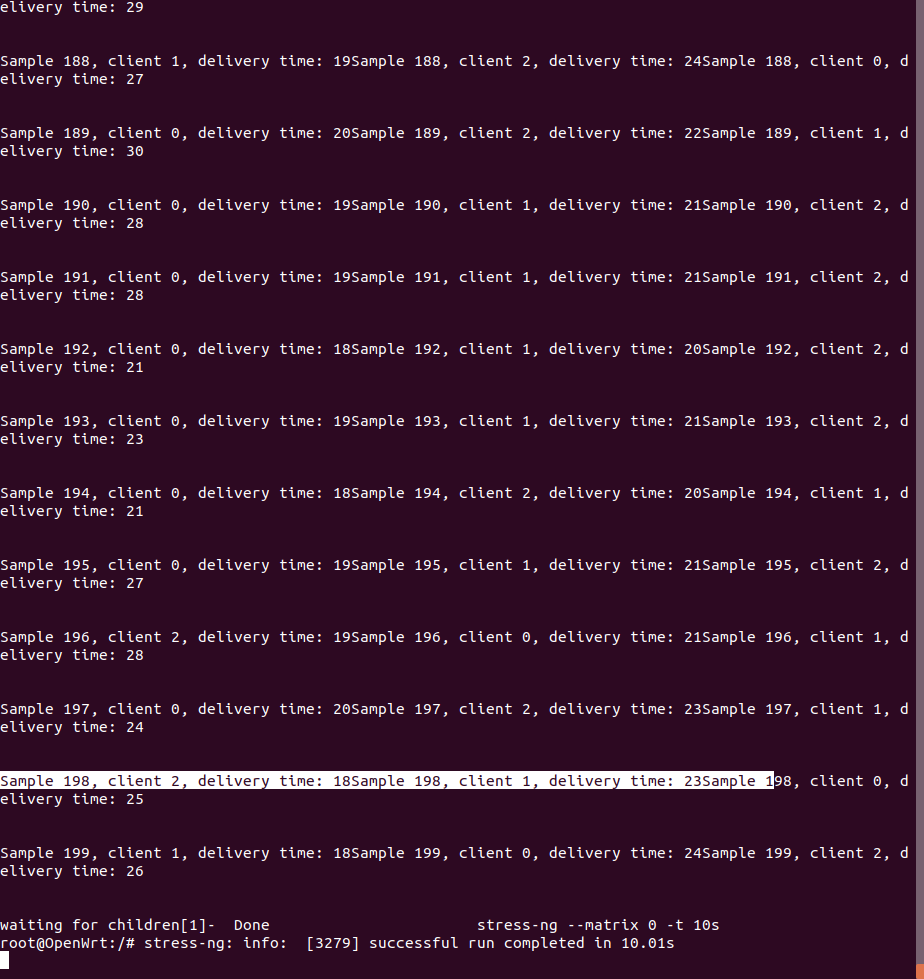

### Wariant 2 3 klientów, 2 rdzenie, pełne obciążenie
Ustawilismy liczbę rdzeni procesora na 2
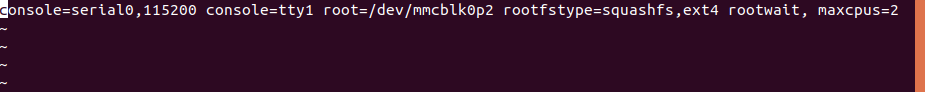

Przy 100.000 wyrabia się
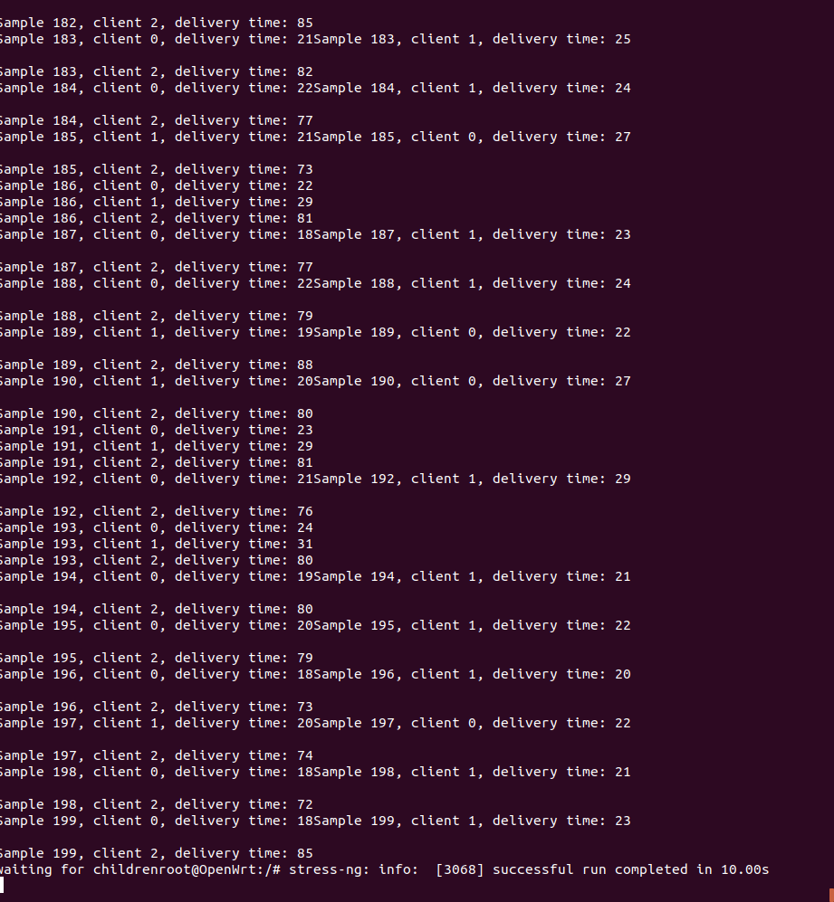

Przy 300.000 wyrabia się
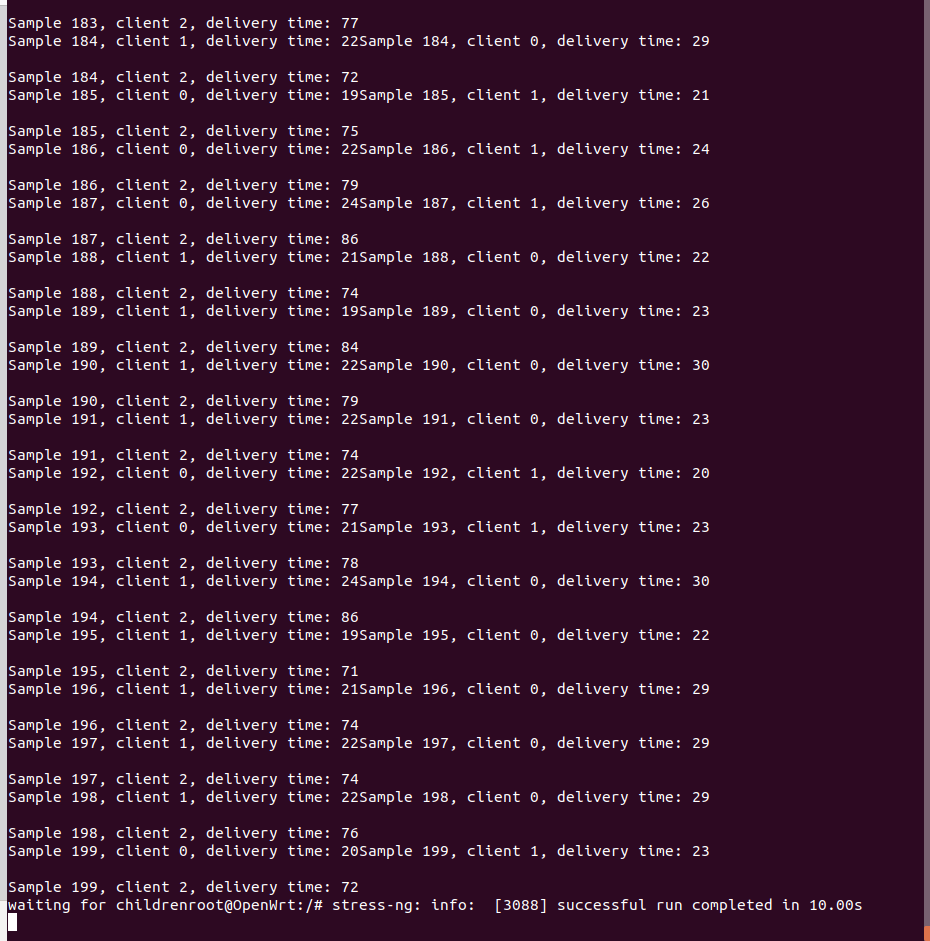

Przy 400.000 nie wyrabia się
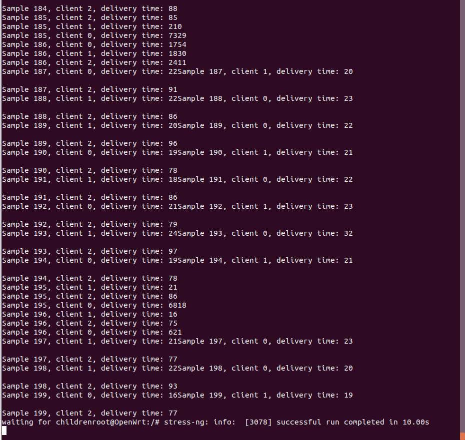

### Wariant 3 3 klientów, 2 rdzenie, bez obciążenia

Przy 450.000 wyrabia się
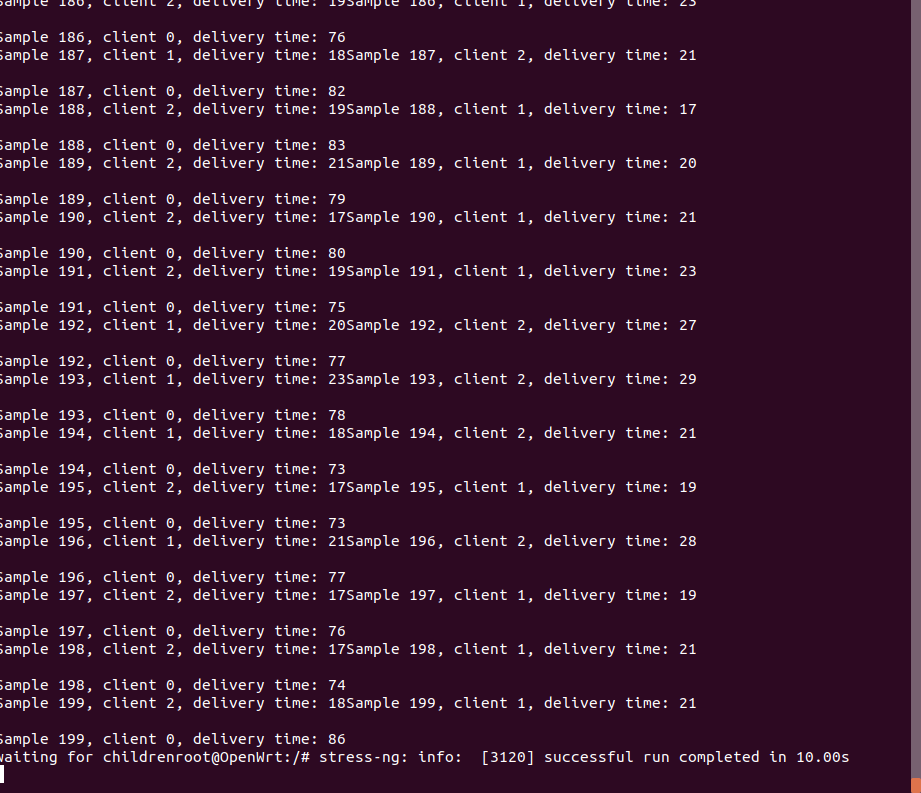

Przy 1.000.000 nie wyrabia się
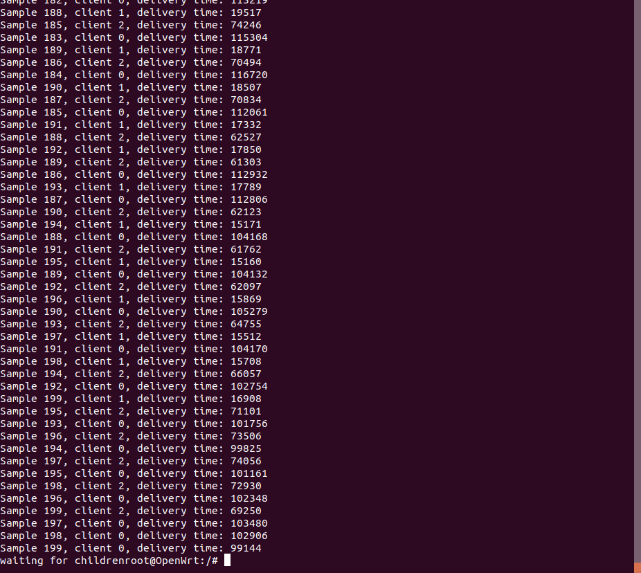

Przy 800.000 nie wyrabia się
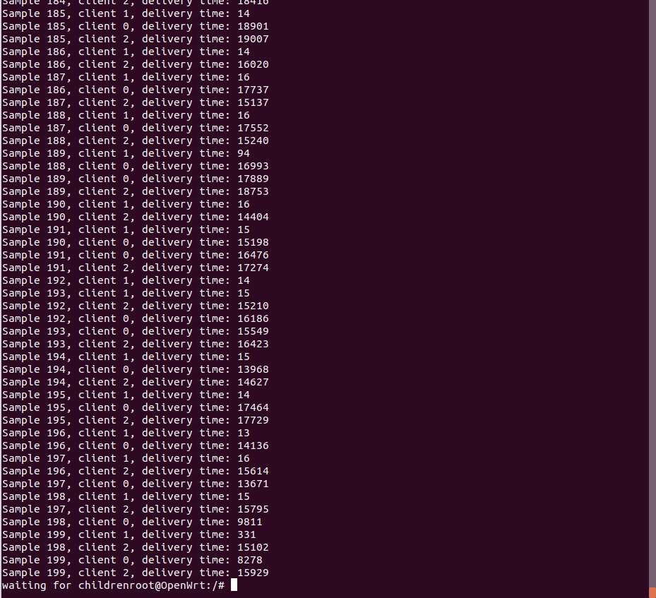

### Wariant 4

