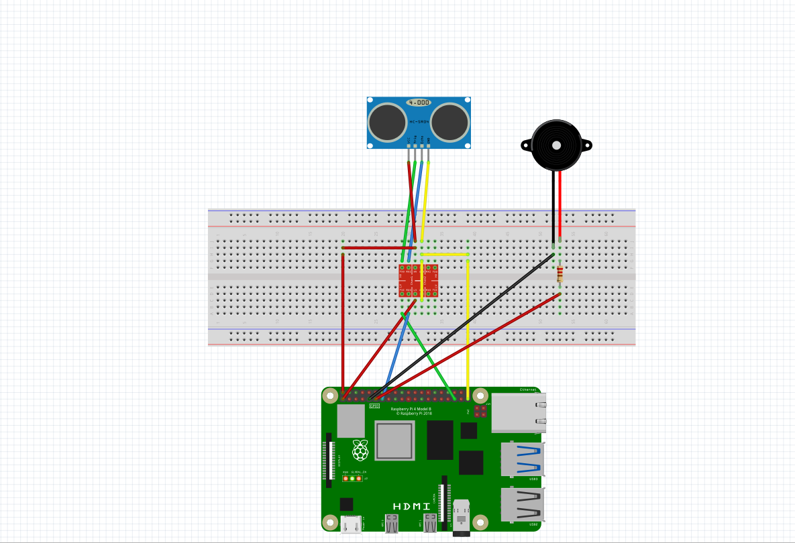
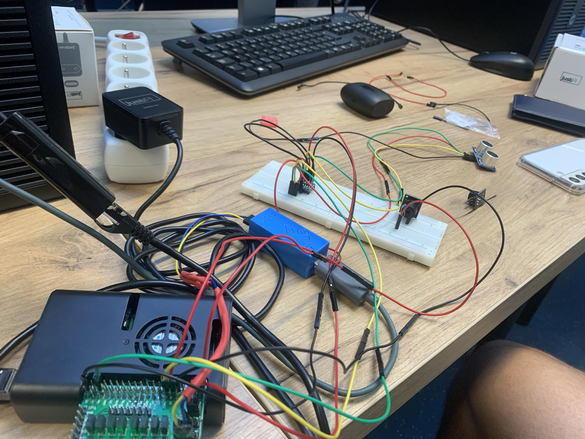

# Sprawozdanie projektu
## Michał Sadowski 325221 Mateusz Ostaszewski 325203

## Realizowany projekt

### Tematem projektu jest zbudowanie stacji badawczej mierzącej temperaturę oraz wilgotność powietrza przy pomocy czujnika temperatury i wigotności oraz wyświetlnie odczytanych wyników na wyświtlaczy LCD, po przekroczeniu ustalonego progu buzzer nadaje sygnał dźwiękowy. Do tego na komputerze wizualizacja danych w czasie rzeczywistym.

## Schemat podłączenie

### Realizacja schematu

## Napotkane problemy

Niestyety nie udało się zrealizować wszystkich zamierzonych celów. Prawodpodobnie problemem był zbyt skomplikowany projekt podłączenia urządzeń.
Z sukcesów udało nam się sprawnie połączyć buzzer oraz wyświetlacz LCD, niestety nie udało się podłączyć czujnika DHT11, oraz zintergrować systemu.

## W repoozytorium znajdują się kody źródłowe które miały na celu realizacje części softwearowej naszego projektu. Niestety przez napotkane probelmy nie udało się przetestować finalnego programu

## W związu z napotkanymi problemami po uzgodnieniu z prowadzącym zdecydowaliśmy się smienić temat projektu.
### *Nowy temat*
Pomiar odlełości realizowany za pomocą czujnika odległości, oraz wysylanie pomiarów w czasie rzeczywistym do maszyny klienta, oraz sygnał dziękowy przy zbyt małej odległości.

### Schemat podłącznia

#### Realizacja schematu

## Relizacja softwear'owa
Zostala wykonana w pythonie, przy użyciu biblioteki gpio4 do łącznia się z urządzeniami, oraz bulbiotek http.server, socketserver do zrealizowania przesyłania danych do klienta w czasie rzeczywistym.
Buzzer jest obsługiwany przez osobny wątek, aby nie zatrzymywać podstawowego wątku który realizuje odczyt i przesył danych do klienta. Zrealizowane jest to w pliku server.py

Klient zrealizowany w pliku client.py zajmuję się pobrniem danych z serwera oraz zwizualizowaniem danych za pomocą matplotlib.pyplot.

## Film prezentacyjny
<video controls src="film_prezentacyjny.mp4" title="Title"></video>

