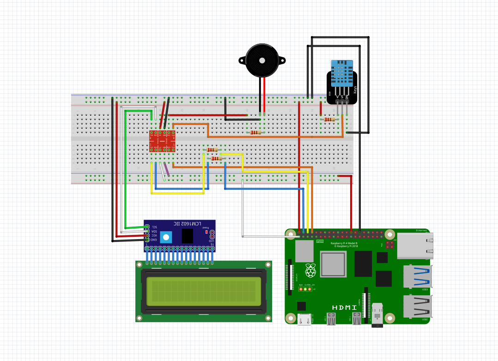
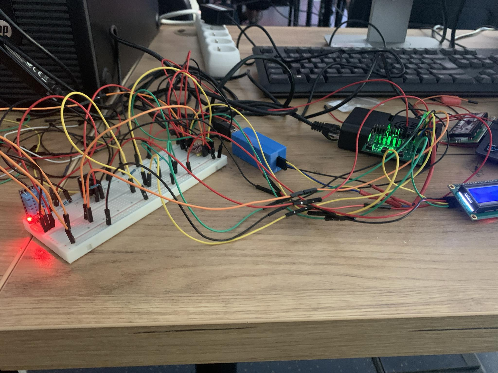

# Sprawozdanie projektu 
## Michał Sadowski 325221 Mateusz Ostaszewski 325203

## Realizowany projekt

### Tematem projektu jest zbudowanie stacji badawczej mierzącej temperaturę oraz wilgotność powietrza przy pomocy czujnika temperatury i wigotności oraz wyświetlnie odczytanych wyników na wyświtlaczy LCD, po przekroczeniu ustalonego progu buzzer nadaje sygnał dźwiękowy. Do tego na komputerze wizualizacja danych w czasie rzeczywistym.

## Schemat podłączenie

### Realizacja schematu

## Napotkane problemy

Niestyety nie udało się zrealizować wszystkich zamierzonych celów. Prawodpodobnie problemem był zbyt skomplikowany projekt podłączenia urządzeń. 
Z sukcesów udało nam się sprawnie połączyć buzzer oraz wyświetlacz LCD, niestety nie udało się podłączyć czujnika DHT11, oraz zintergrować systemu.

## W repoozytorium znajdują się kody źródłowe które miały na celu realizacje części softwearowej naszego projektu. Niestety przez napotkane probelmy nie udało się przetestować finalnego programu

##